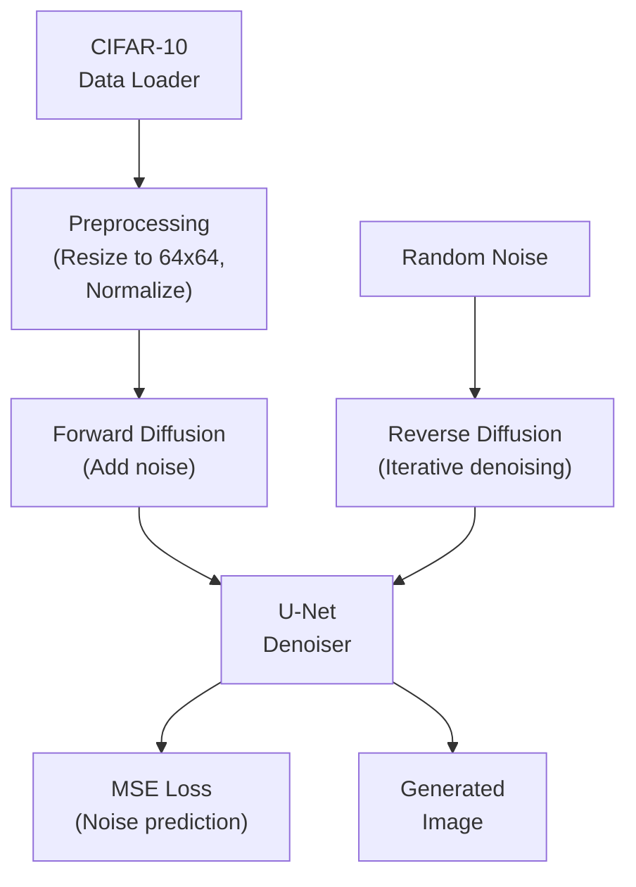

# Simple Diffusion Model Training Plan (Jupyter Notebook)

## Overview

Implement a Denoising Diffusion Probabilistic Model (DDPM) from scratch using PyTorch in a Jupyter notebook for generating 64x64 images from the CIFAR-10 dataset. The implementation will include data loading, U-Net architecture, forward/reverse diffusion processes, training loop, and sampling - all organized in a single interactive notebook.

## Architecture Components



## Project Structure

```
Diffusion Models/
├── diffusion_model.ipynb   # Main Jupyter notebook with all code
├── requirements.txt        # Dependencies
└── README.md              # Setup and usage instructions
```

## Notebook Structure

The notebook will be organized into logical sections with markdown cells for documentation:

### 1. Setup and Imports

- Import all necessary libraries (torch, torchvision, numpy, matplotlib, etc.)
- Set device (MPS for M3 if available, else CPU)
- Set random seeds for reproducibility
- Display system info (device, PyTorch version)

### 2. Configuration

- Hyperparameters as variables:
  - Image size: 64x64
  - Batch size: 64 (adjustable for M3)
  - Learning rate: 2e-4
  - Number of timesteps (T): 1000
  - Number of epochs: 50-100
  - β schedule parameters (linear: 0.0001 to 0.02)

### 3. Dataset Loading

- Download CIFAR-10 using `torchvision.datasets.CIFAR10`
- Resize images from 32x32 to 64x64 using `transforms.Resize()`
- Normalize pixel values to [-1, 1] range
- Create DataLoader with appropriate batch size
- Visualize sample images from dataset

### 4. Diffusion Process Implementation

- **Noise Scheduler**:
  - Compute β_t values (linear schedule)
  - Compute α_t = 1 - β_t
  - Compute cumulative ᾱ_t = ∏α_i
- **Forward Diffusion Function**:
  - `def forward_diffusion(x_0, t, noise)`
  - Apply: `x_t = sqrt(ᾱ_t) * x_0 + sqrt(1 - ᾱ_t) * noise`
  - Visualize forward diffusion process on sample image
- **Reverse Diffusion Function**:
  - `def sample(model, shape, device)`
  - Iterative denoising from t=T to t=0
  - Apply DDPM sampling formula

### 5. U-Net Model Architecture

- Define U-Net class with:
  - **Encoder blocks**: Conv2d → GroupNorm → SiLU → Downsample
  - **Bottleneck**: Self-attention layer
  - **Decoder blocks**: Upsample → Conv2d → GroupNorm → SiLU
  - **Time embedding**: Sinusoidal positional embeddings + MLP
- Input: `(batch, 3, 64, 64)` image + `(batch,)` timestep
- Output: Predicted noise `(batch, 3, 64, 64)`
- Keep model lightweight for M3: ~5-10M parameters
- Display model architecture summary

### 6. Training Loop

- Initialize model, optimizer (Adam, lr=2e-4), and loss function
- Training loop with progress bar (tqdm):
  - Sample batch of images
  - Sample random timesteps `t ~ Uniform(0, T)`
  - Add noise to images at timestep `t`
  - Predict noise using U-Net
  - Compute MSE loss between predicted and actual noise
  - Backpropagate and update weights
- Save model checkpoints periodically
- Generate and display sample images during training (every N epochs)
- Plot training loss curve

### 7. Sampling and Generation

- Load trained model (or use current model state)
- Generate random noise `x_T ~ N(0, I)`
- Run reverse diffusion process
- Display generated images in a grid
- Save generated images

### 8. Visualization Utilities

- Helper functions for:
  - Displaying image grids
  - Plotting loss curves
  - Visualizing diffusion process step-by-step
  - Comparing real vs generated images

## Implementation Details

### Key Functions to Implement

1. **`forward_diffusion(x_0, t, noise)`**: Add noise to clean images
2. **`sample(model, shape, device)`**: Generate images from noise
3. **`UNet` class**: Denoising network architecture
4. **Training function**: Complete training loop with logging

### M3 MacBook Air Optimizations

- Use `torch.backends.mps` for Apple Silicon acceleration
- Start with batch size 32-64, adjust based on memory
- Use gradient accumulation if needed for larger effective batch sizes
- Monitor memory usage with `torch.cuda.memory_allocated()` (or equivalent for MPS)
- Consider using `torch.compile()` if PyTorch 2.0+ for performance

### Training Considerations

- **Total timesteps (T)**: 1000 (standard for DDPM)
- **Epochs**: Start with 50-100 epochs (adjust based on convergence)
- **Learning rate**: 2e-4 with optional cosine annealing
- **Loss function**: MSE between predicted and actual noise
- **Evaluation**: Generate samples every 5-10 epochs to visualize progress
- Use tqdm for progress bars during training

## Notebook Features

- Clear markdown sections explaining each component
- Inline visualizations of data, training progress, and generated samples
- Interactive cells for easy experimentation
- Ability to resume training from checkpoints
- Real-time loss plotting during training

## Setup Instructions

1. Install dependencies:
   ```bash
   pip install -r requirements.txt
   ```

2. Open the notebook:
   ```bash
   jupyter notebook diffusion_model.ipynb
   ```
   or
   ```bash
   jupyter lab diffusion_model.ipynb
   ```

3. Run cells sequentially to train the model

4. The CIFAR-10 dataset will be automatically downloaded on first run
